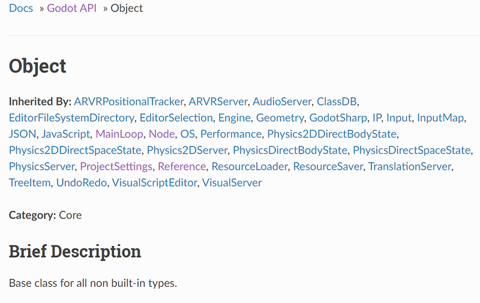

.. _doc_godot_essentials:

Godot essentials guide
======================

If you've come here, you must want to create a game. You know the idea
of what you want to build, but not *how* to build it *in Godot*. If so,
you've come to the right place.

Object-oriented design
----------------------

.. image:: img/all_in_one_objects.png

Godot Engine uses an Object-Oriented game framework. This means it is
made up of abstract templates that allow you to build concrete things.
The abstract template is called a *class*. The things you actually interact
with are *instances* of a class.

Users can create content with Godot's large library of built-in classes, but
the first one to learn is the base Object class. It can define the
following elements:

- variables: Pieces of data. Also known as "properties" when associated
  with a class.

- functions: Pieces of behavior. Also known as "methods" when associated
  with a class.

- constants: *Static* and unchanging pieces of data. By *static*, we
  mean that the data is owned by the class, not by any one instance.

- signals: Declarations that something happened, similar to events
  in other game frameworks.

Every other class in Godot ``extends Object``, or extends something else that
extends Object, at some remove. Each possesses all the properties, methods,
constants, and signals of the class it extends plus those unique to
it. This chaining of elements in classes is called "Inheritance."

To see examples of these elements defined in various scripting languages,
please see the language-specific sections of the :ref:`scripting documentation <doc_scripting>`.

To see a full description of any class, one can check the
:ref:`Class Reference <doc_classes>`, also known as the 
:ref:`API <https://en.wikipedia.org/wiki/Application_programming_interface>`__.
The :ref:`Object API docs <class_Object>` help to demonstrate these concepts.

.. _doc_reading_the_class_api::

Reading the Class API
---------------------

Each page details the name and description of a class along with the class
it inherits, those which inherit from it, and all elements related to it.

The properties table has three columns. On the left is the
"data type". This could be a class, like ``Object``, or a primitive like int 
(``5``), float (``3.14``), or bool (``true``/``false``). In the middle is the
text identifier, i.e. name, i.e. the thing you write to use it. On the right
is the default value of the property.

The methods table is a bit more complex. The left-hand column has the data type
that is returned to you when you call, i.e. execute, the method. The right-hand
column starts with the name of the method followed by a parentheses-enclosed
list of the variables that must be provided to the method, also known as
"parameters." Note that this is a guide to what values you can feed to it, not
an example of *syntax*.

Each parameter in the list follows the format
``DataType ParameterName[= OptionalDefaultValue],``. If a default value is
present, then it means you can omit that parameter when calling the method,
i.e. it is optional. When calling a method, you must provide parameters in
the same order with the same/compatible data types. A ``void`` data type means
that it does not return a value; the method itself does something.

Some methods have special suffixes to more clearly indicate their behavior.
A `const` suffix means that calling the method on an instance does not modify
that instance's data. A `virtual` suffix means that you can write your own
version of the method to plug in behavior somewhere else. A `vararg` suffix
means that the method accepts an unlimited number of parameters, indicated
by a `...` in the method's parameter list.

The constants section gives the name of the constant and the integer value it
corresponds to. Enumerations are groups of constants with their own
*data type*. For example, the Object class's ``OBJECT_*`` constants are
associated with the ``ConnectFlags`` enum that Object defines.

You may also see a Tutorial section that provides links to other official web
documentation related to the class.

.. note::

  The entire API is also available offline from the Godot Editor's
  "Search Help" utility.

MainLoop, the SceneTree, and Nodes
----------------------------------

- Mainloop
- SceneTree
- Nodes, aggregation/composition versus inheritance
- NodePaths, $
- ``onready``
- Callbacks
- Notifications
- Signals
- Groups
- Static versus dynamic element access

Memory, references and resources
--------------------------------

- Memory management
- Reference-counting
- Serialization
- Resources
- Scripts and PackedScenes
- Custom Resources

The editor, tools, and plugins
------------------------------

- The Godot Editor is a SceneTree
- tool scripts
- Creating plugins
- EditorInspectorPlugins
