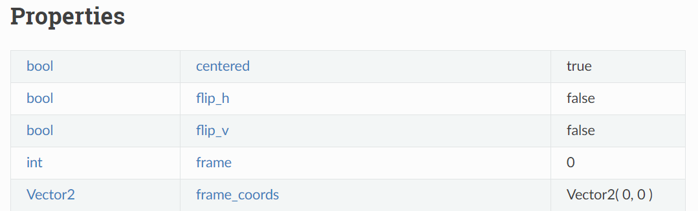
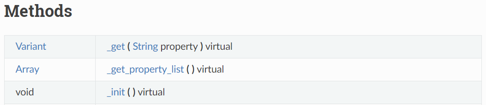
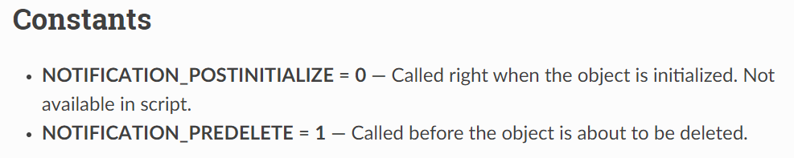
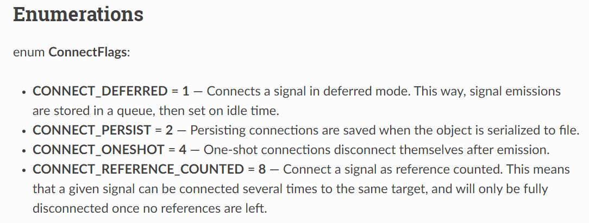
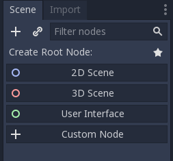

.. _doc_godot_essentials:

Godot essentials guide
======================

If you've come here, you must want to create a game. You know the idea
of what you want to build, but not *how* to build it *in Godot*. If so,
you've come to the right place.

Object-oriented design
----------------------

Godot Engine uses an Object-Oriented design. This means it is
made up of abstract templates that allow you to build concrete things.
The abstract template is called a *class*. The things you actually interact
with are *instances* of a class.

Users can create content with Godot's large library of built-in classes, but
the first one to learn is the base Object class. It can define the
following elements:

- variables: Pieces of data. Also known as "properties" when associated
  with a class.

- functions: Pieces of behavior. Also known as "methods" when associated
  with a class.

- constants: *Static* and unchanging pieces of data. By *static*, we
  mean that the data is owned by the class, not by any one instance.

- signals: Declarations that something happened, similar to events
  in other game engines.

Every other class in Godot ``extends Object``, or extends something else that
extends Object, at some remove. Each possesses all the properties, methods,
constants, and signals of the class it extends plus those unique to
it. This chaining of elements in classes is called "Inheritance."

As a Godot user, you will create a script file that defines a base class and
a list of custom elements. You can then assign that script to an instance of
that base class to append to or, in some cases, override, the base class's
elements.

To see examples of these elements defined in Godot's scripting languages,
please see the language-specific sections of the :ref:`scripting documentation <doc_scripting>`.

To see a full description of any class, one can check the
:ref:`Class Reference <doc_classes>`, also known as the 
`API <https://en.wikipedia.org/wiki/Application_programming_interface>`__.
The :ref:`Object API docs <class_Object>` help to demonstrate the above concepts.

.. _doc_reading_the_class_api:

Reading the Class Reference
---------------------------

.. image:: img/essentials_api_inheritance.png

Each page details the name and description of a class along with the class
it inherits, those which inherit from it, and all elements related to it.

The properties table has three columns. On the left is the
"data type". This could be a class, like ``Object``, or a primitive like int 
(``5``), float (``3.14``), or bool (``true``/``false``). In the middle is the
text identifier, i.e. name. On the right is the default value of the property.

The methods table is a bit more complex. The left-hand column has the data type
that is returned to you when you call, i.e. execute, the method. A ``void``
data type means that it does not return a value; the method itself does
something. The right-hand column starts with the name of the method. A 
parentheses-enclosed list of variables then follows. These are the "parameters"
that you must give to the method to call it. Note that this is a guide to what
values you can feed to it, not an example of *syntax*.

Each parameter in the list follows the format
``DataType ParameterName[= OptionalDefaultValue][Comma]``. You must provide
parameters in the same order with compatible data types. If a default value is
present, then you can omit it to have Godot assume its value.

Some methods have special suffixes to more clearly indicate their behavior.

- `const`: calling the method on an instance does not modify that instance's
  data.

- `virtual`: you can write your own version of the method to plug in behavior
  somewhere else.

- `vararg`: the method accepts an unlimited number of parameters, indicated by
  a `...` at the end of the method's parameter list.

The constants section gives the name of the constant and the integer value it
corresponds to.

Enumerations are groups of constants with their own
*data type*. For example, Object defines a ``ConnectFlags`` data type with
enumerated values that appear as constants starting with ``CONNECT_*``.

Some classes also have a Tutorial section that provides links to other official,
related web documentation.

.. note::

  The entire API is also available offline from the Godot Editor's
  "Search Help" utility. Press ``Shift + F1`` or go to ``Help > Search Help``
  in the main toolbar to access it.

.. note::

  If you'd like to learn how to contribute to the Class Reference, please
  see the related documentation on
  :ref:`Submitting a pull request <doc_pr_workflow>` and
  :ref:`Updating the Class Reference <doc_updating_the_class_reference>`.

MainLoop and the SceneTree
--------------------------

The next class to learn about is the :ref:`MainLoop <class_MainLoop>` class. It
manages the game's core iteration loop and the OS window that it runs in. It
detects when the window is in focus, when the game crashes, and when the user
quits, among other things. The data it provides changes based on the platform
Godot runs on (desktop, web, mobile). It also handles iterative processes like
frame calculations and checking for input.

MainLoop is then inherited by the :ref:`SceneTree <class_SceneTree>` class.
The SceneTree is your actual Godot game instance. It builds on top of MainLoop
to enable users to manage a world of content, change it, organize it, and help
it communicate over networks. To be more specific, SceneTree manages a tree
hierarchy of :ref:`Nodes <class_Node>`.

Nodes, Node trees
-----------------

Nodes are Godot's fundamental worldbuilding unit. They can each have one
parent node and many child nodes. Attaching one node to another forms a
tree. Trees are recursive structures, built out of subtrees. In fact, a tree
can even be a single node. This grants them many significant features. You
can...

1. build nodes into a tree.
2. subdivide a tree into smaller trees.
3. attach trees to other trees as children.
4. reorganize the nodes within a tree to produce a new tree.
5. masquerade a tree as a node.
6. create and delete entire trees.

We'll refer to these later in this guide as "tree features".

The lack of a major distinction between a tree of nodes and a single node
is what sets Godot apart. Nodes serve as the foundation of a flexible game
world that you can freely manipulate.

Notifications
-------------

Nodes are also entry points for interacting with the world. The SceneTree
sends all nodes inside it *notifications* about things that happen like
advancing to a new frame or an input detection. Nodes can then opt-in to
respond to these notifications and do things in the world.

Users create a script that ``extends Node`` and which defines methods that
respond to notifications. The Node instance passes these methods
*back* to the engine which *calls* them at the correct time; Therefore, they
are known as *callbacks*. They appear as virtual methods with leading
underscores in the Class Reference. See the "Methods" table at the top of the
:ref:`Node API docs<class_Node>` for examples.

While the most frequently used notifications have their own callbacks,
Godot also has a master callback for handling any notification:
:ref:`Object._notification <class_Object_method__notification>`. As
you can see, notifications are an Object feature, so you will find them
scattered throughout the Class Reference. Search for ``NOTIFICATION_``
constants to find them; they will be the value of the
``_notification`` method's parameter.

{{ Should I omit this code sample? Too confusing? }}

.. tabs::
  .. code-tab:: gdscript GDScript

    extends Node
    func _notification(what):
        match what:
            NOTIFICATION_PARENTED:
                print("I was just parented to " + get_parent().name + "!")

  .. code-tab:: csharp

    public class MyNode : public Node
    {
        public override void _Notification(int what)
        {
            switch(what)
            {
                case Node.NOTIFICATION_PARENTED:
                    GD.Print("I was just parented to " + GetParent().Name + "!");
                    break;
                default:
                    break;
            }
        }
    }

Scenes
------

So you've `downloaded <https://godotengine.org/download>`__ a copy of
Godot and :ref:`created a new project <doc_creating_a_new_project>`. How
do you actually start building your SceneTree content?

On the left side of the editor, you should see a "Scene" dock:

Right now, because it is empty, it offers suggestions for a "root node" that
you could add to a "scene". But this image alone gives rise to several
questions:

What is a "scene"?

  The game world is built out of a node tree, but it wouldn't be reasonable to
  build the entire tree in one
  `hardcoded <https://stackoverflow.com/questions/1895789/what-does-hard-coded-mean>`__,
  `monolithic <https://www.quora.com/What-is-the-difference-modular-vs-monolithic-programming-for-applications>`__ node hierarchy.
  
  Instead, we use tree feature #2 and subdivide our SceneTree's
  entire node tree into subtrees. This lets us examine each
  subtree in isolation to develop it, test it, and track its dependencies.
  We call these subtrees "scenes" and save them to files:
  ``.tscn`` and ``.scn`` for text and binary, respectively.

  Due to tree feature #3, you can nest scenes within other scenes. This builds
  a *tree of scenes* managed by your *SceneTree* instance.

What is a "root node"?

  Because every scene is a tree, it necessarily has a root node.
  Godot's architecture forces an Object-Oriented paradigm at every level.
  All world content, even your environments, must be a direct extension of a
  single Node class.

How do I decide which node to use as root?

  Which node you choose as the root affects how the scene interacts with others.

  For example, if you create 2D content, you can put it under a
  :ref:`Node <class_Node>` root or a :ref:`Node2D <class_Node2D>` root,
  among other things. Each has a unique impact on their relationship to the
  content.

  A Node2D will position itself relative to its parent Node2D's
  :ref:`Transform2D <class_Transform2D>`. A Node, however, will ignore the
  parent's Transform2D because it does not have one. Therefore, your scene's 2D
  content either will or will not follow a moving parent. This kind of
  `declarative code <https://stackoverflow.com/questions/129628/what-is-declarative-programming>`__
  by way of node composition is a core feature of Godot Engine.

  In addition, the root node dictates how other scenes perceive the current
  scene. By default, nested scenes appear as a single node (the root). It's
  script then
  `encapsulates <https://en.wikipedia.org/wiki/Encapsulation_(computer_programming)>`__
  its internal nodes by providing an interface for interacting with them.
  
  Scenes allow users to design a class's
  `constructor <https://www.techopedia.com/definition/5656/constructor>`__
  in a visual editor.
  
Why would a root node ever NOT be in 3D, 2D, or UI space?

  Not every class you create will need to have a position in space. Some
  will be bundles of data or behavior with a direct link to the world. 
  
  This includes nodes that enable a behavior for something else. For example,
  you might have a Jump node that handles configuration and calculations for
  jump logic. Anything with a Jump node then has a common jump API and
  implementation.
  
  It also includes nodes that serve as standalone gameplay systems. For
  example, you might have a TurnBasedCombat singleton that manages the
  state of a turn-based game. Other nodes in the game then have a common
  point of reference for safely handling data
  :ref:`they don't own <doc_autoloads_versus_internal_nodes>`.

In other engines, users often have a workflow similar to this:

1. Create an ``entity``.
2. Add behavioral ``components`` to it
3. Save it as a reproducible ``prefab``
4. Stick many instances of this prefab inside a ``level`` container.

Godot instead just makes everything a ``node``.

1. Build a unique ``node`` that does what you need.
   1. A ``node`` that represents a thing in your world is an ``entity``.
   1. A ``node`` with data or behavior for a parent to use is a ``component``.
   1. Users design a ``node``, and the children it wraps, as a reproducible class via a scene and/or script.
   1. Nodes wrap other nodes and thus are containers too.

So Godot unifies entities, components, prefabs, and levels all together into
just the concept of defining node classes. The Godot Editor is a visual class
editor. Even the Godot Editor itself is just a single
`EditorNode <https://github.com/godotengine/godot/blob/master/editor/editor_node.h>`__
class!

Node flexibility
----------------

So let's finally get started!

1. "We want to create a 2D scene."
   1. Create Node2D.

1. "We want to create an image that fetches an image from the Internet, plays an SFX while loading and displays an animated loading icon, and then plays a sound effect *ding* when it loads and *pops* on the screen a bit."
   1. Create Sprite child as child of Node2D and give it the following children:
   1. HttpRequest: to submit the request for the image data over the Internet.
   1. AudioStreamPlayer: to play the sound effect *ding*.
   1. Tween: to animate the loading icon and scale the sprite's image to *pop* when done.
   - Note that using nodes, we have a vague idea of what something does at a glance.
     It *is* a Sprite that *has* the ability to communicate over the Internet, play audio, and do tween animations.

1. "Right now, the Sprite is part of an environment, but we want it to be its own class. How do we do that?"
   1. Right-click the Sprite node and select, "Save Branch as Scene". Save the scene file. Voila, it is now its own class.
   1. Notice how the original scene has automatically replaced the node tree with an instance of our new scene.
   1. Now click the slideshow icon beside the Sprite. Now you are editing the Sprite's class in a new tab!

1. "What if I want to re-use parts of my new scene back in my old scene?"
   1. In new scene, set AudioStreamPlayer property ``autoplay`` to true. Save the scene.
   1. Switch back to environment scene. Right click root node and select, "Merge From Scene".
   1. Click the top-right button of the popup to select the new scene. It's node tree will be displayed.
   1. Select the AudioStreamPlayer and select "OK".
   1. That specific AudioStreamPlayer configuration will be copied from that scene to the current scene. Any tree of nodes can be copied this way.
   1. Confirm by seeing that the ``autoplay`` property is checked rather than unchecked (which is the default).

1. "What if I want to be able to tweak and/or override a node's internals from an owning scene?"
   1. In the environment scene, right-click the Sprite scene instance and toggle on, "Editable Children".
   1. Now you can directly access that scene's child nodes!

1. "What if I don't want other people on my team to be able to see and edit a node's internals from the editor?"
   1. Create a GDScript file like so:

        tool
        extends Sprite
        class_name InternetTweenSprite

        var http
        var audio
        var tween

        func _init():
            http = HttpRequest.new()
            audio = AudioStreamPlayer.new()
            tween = Tween.new()
            add_child(http)
            add_child(audio)
            add_child(tween)
            texture = preload("res://icon.png")
            modulate = Color(1, 0, 0)

      Voila, you now have a custom scripted class with all of the same features and none of it exposed to the user!

1. "What if I want to create a new class that extends my custom script?"
   1. Right-click the InternetTweenSprite and select, "Extend Script".
   1. The ScriptCreateDialog will open with "InternetTweenSprite" prefilled as the class to inherit from!
   1. When you create the script, the node will automatically switch to using the new script.

1. "What if I want to create a new class that extends my scene?"
   1. Option A:
      1. From the toolbar, select ``Scene > New Inherited Scene...``.
      1. Select the ``internet_tween_sprite.tscn`` file.
      1. Save your new scene. Done!
   1. Option B:
      1. From the toolbar, select ``Scene > New Scene``. 
      1. Select the chain-link icon beside the plus sign in the ``Scene`` dock.
      1. Select the ``internet_tween_sprite.tscn`` file.
      1. Save your new scene. Done!

1. "Now I want my environment to just be a character. How do I re-use the same node hierarchy, but put it under a KinematicBody2D instead of a Node2D? Do I have to remake it from scratch?"
   1. Option A:
      1. Create a new scene.
      1. Use the "Merge from Scene" option to migrate a subset of desired nodes into the new scene.
   1. Option B:
      1. Right-click the root node and select, "Change Node".
      1. Choose KinematicBody2D. Now the entire scene is a KinematicBody2D instead of a Node2D!

1. "I've decided I no longer want this to be a character at all, but a scene that extends my InternetTweenSprite which is a child of the character. What do I do?"
   1. Right-click the InternetTweenSprite and select, "Make Scene Root".
   1. If you want to, reparent the other child nodes under the new root and delete the old root node.

~~~~

Inheritance, Aggregation, and Scenes
------------------------------------

Inheritance is where one class *inherits* the behaviors of another class; they
have an "is-a" relationship. Aggregation is where one class instance manages
access to another class instance and *uses* it to execute behaviors for its
sake; they have a "has-a" relationship.

Godot's Node hierarchies employ a mix of the two. Related functionality that
builds on each other is often combined into an inheritance relationship. For
example:

- Node *is* a structural unit.
- Node2D *is* a Node that has a 2D position in the world. Child Node2Ds move
  relative to their Node2D parents, so trees of Node2Ds move together.

With a 2D position, we can create various chains of functionality:

- CanvasItem *is* a Node2D that can draw things.
- Sprite *is* a CanvasItem that draws an image relative to its 2D position.

or...

- PhysicsBody2D *is* a Node2D that interacts with the physical world.
- KinematicBody2D *is* a Node2D that can move with custom physics movement.

Each of these are things we may wish to use and reproduce often. They have
properties that configure how they work and methods to engage in behaviors
they support. They each have a class that builds a layer of features over
the previous one.

Now let's see this example:

- A KinematicBody2D called "Player".
- "Player" *has* a Sprite called "HeadSprite"
- "Player" *has* a Sprite called "TorsoSprite"
- "Player" *has* a Sprite called "LegsSprite"

Now, we could define a new class, but creating 

In aggregation, the owning instance delegates responsibilities to the owned
instance and takes credit for the work. Other owning instances don't know whilst other owning instances have no idea it even owns
other things

To add a feature to the world, you must embody that feature as a Node-derived
class and add that node to the SceneTree.

.. image:: /img/essentials_scene_dock_empty.png

---

- Mainloop
- SceneTree
- Nodes, aggregation/composition versus inheritance
- NodePaths, $
- ``onready``
- Callbacks
- Notifications
- Signals
- Groups
- Static versus dynamic element access

Memory, references and resources
--------------------------------

- Memory management
- Reference-counting
- Serialization
- Resources
- Scripts and PackedScenes
- Custom Resources

The editor, tools, and plugins
------------------------------

- The Godot Editor is a SceneTree
- tool scripts
- Creating plugins
- EditorInspectorPlugins
